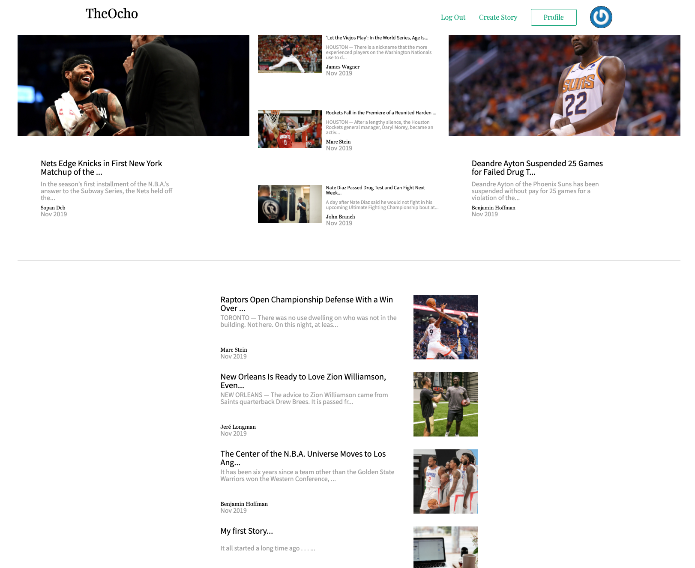

# The Ocho 

The Ocho is a Medium clone that allows users to create articles and share what's one their mind about the sports world.  It Also allows for users to like articles and comment on articles that they find interesting. 

# Demo 
[The Ocho](http://the-ocho.herokuapp.com/#/)

# Technologies

## Backend 
* PostgreSQL and Ruby on Rails
  * seed and store and access information pertaining to users

## Frontend 
* React.js, Redux, JavaScript, CSS/HTML, Webpack
  * Create user friendly interfaces that allow for easy navigation of the site 

## Deployment 
* AWS, Heroku 
  * Deploy site 
  * Store assets used by site

# Features 

## Dynamic grid and responsive design 

Users have a beautifully designed responsive home page that allows them to visit the site on any device.  This was done using grid implementations and media queries. 

## Modal Gate

A modal restricts users that do not have an account or are not signed in from seeing entire articles or interacting with other parts of the site.  

